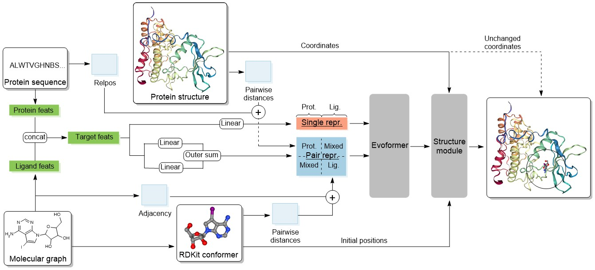

# QuickBind - A Light-Weight And Interpretable Molecular Docking Model



This repository contains the code for (link to paper).

## Creating the environment

You can create the conda environment on a Linux system using the following commands.
```bash
conda create --name quickbind
conda activate quickbind
conda install pytorch==1.12.1 torchvision==0.13.1 torchaudio==0.12.1 cudatoolkit=11.3 -c pytorch
conda install pytorch-lightning==1.9 -c conda-forge
pip install torch-scatter -f https://data.pyg.org/whl/torch-1.11.0+cu113.html
pip install torch-sparse -f https://data.pyg.org/whl/torch-1.12.1+cu113.html
pip install torch-geometric
conda install -c conda-forge rdkit=2022.03.2
pip install wandb
pip install nvidia-pyindex
pip install nvidia-dllogger
pip install spyrmsd
pip install biopython
```
You also need to install OpenFold:
```bash
git clone https://github.com/aqlaboratory/openfold.git
cd openfold
git checkout efcf80f50e5534cdf9b5ede56ef1cbbd1471775e
pip install ./
```

## Downloading training and evaluation data

Download the PDBBind dataset and place it in the `data/` directory:
```bash
wget https://www.zenodo.org/record/6408497/files/PDBBind.zip?download=1
unzip 'PDBBind.zip?download=1'
mv PDBBind_processed/ PDBBind/
mv PDBBind/ data/
```
Similarly, the PoseBusters benchmark set can be downloaded from [zenodo](https://zenodo.org/records/8278563), and should be placed in the data directory as well, such that you have `data/posebusters_benchmark_set`.

## Training the model

QuickBind was trained using gradient accumulation on two 4-GPU nodes, resulting in an effective batch size of 16. The number of nodes can be set using the `num_nodes` argument of `pl.Trainer` in [train_pl.py](train_pl.py). The number of iterations over which to accumulate gradients can be set using the `iters_to_accumulate` keyword in the configuration file. To train QuickBind using its default parameters, run:
```bash
python train_pl.py --config configs/quickbind_default.yml
```
For fine-tuning using a larger crop size, add `--finetune True`. To resume training from the most recent checkpoint file, add `--resume True` and provide the Weights & Biases ID to the `--id` flag. After training, copy the configuration file to the checkpoints directory, for example, like so:
```bash
cp configs/quickbind_default.yml checkpoints/quickbind_default/config.yaml
```
Model weights are stored in [checkpoints/quickbind_default](checkpoints/quickbind_default), which also contains model weights for the final QuickBind model.

## Running inference

The following command will run inference on the PDBBind test set using the model weights with the lowest validation loss from `checkpoints/quickbind_default`:
```bash
python inference.py --name quickbind_default
```
Adding `--unseen_only True` will only include proteins that the model has not seen during training. Adding `--save_to_file True` will save the predictions to SD files. Adding `--pb_set True` will run inference on the PoseBusters test set.

To facilitate the reproduction of the results from the paper, we provide processed input files for the PDBBind and PoseBusters test sets, and predictions of the final model, including SD files, on [zenodo](https://zenodo.org/records/12509123). To use the preprocessed input files, download them and put them in `data/processed/timesplit_test` and `data/processed/posebusters`, respectively:
```bash
wget https://zenodo.org/records/12509123/files/QuickBind_Zenodo.zip?download=1
unzip 'QuickBind_Zenodo.zip?download=1'
mv QuickBind_Zenodo/processed_input_files/timesplit_test/ data/processed/
mv QuickBind_Zenodo/processed_input_files/posebusters/ data/processed/
```

To evaluate the provided predictions, download them, place them in `checkpoints/quickbind_default`, and run the inference script:
```bash
mv QuickBind_Zenodo/predictions/* checkpoints/quickbind_default/
python inference.py --name quickbind_default
```

## Binding affinity prediction

Download, extract, and process the raw PDBBind data:
```bash
wget https://pdbbind.oss-cn-hangzhou.aliyuncs.com/download/PDBbind_v2020_plain_text_index.tar.gz
tar -xf PDBbind_v2020_plain_text_index.tar.gz
python scripts/process_binding_affinities.py
```
This will create a pickled dictionary with the binding affinities of all complexes in the PDBBind dataset (`binding_affinity_dict.pkl`).

Generate training, validation, and test embeddings:
```bash
python inference.py --name quickbind_default --train_set True --output_s True
python inference.py --name quickbind_default --val_set True --output_s True
python inference.py --name quickbind_default --output_s True
```
Alternatively, we provide extracted embeddings on [zenodo](https://zenodo.org/records/12509123):
```bash
mv QuickBind_Zenodo/predictions_w_embeddings/predictions-w-single-rep-curr-train.pt checkpoints/quickbind_default/train_predictions-w-single-rep.pt
mv QuickBind_Zenodo/predictions_w_embeddings/predictions-w-single-rep-curr-val.pt checkpoints/quickbind_default/val_predictions-w-single-rep.pt
mv QuickBind_Zenodo/predictions_w_embeddings/predictions-w-single-rep-curr.pt checkpoints/quickbind_default/predictions-w-single-rep.pt
```

To train and evaluate the binding affinity prediction model run:
```bash
python train_binding_affinity.py
```

We provide the weights of the final trained model under [checkpoints/binding_affinity_prediction/](checkpoints/binding_affinity_prediction/). To evaluate the binding affinity prediction model using these weights run:
```bash
python train_binding_affinity.py --ckpt checkpoints/quickbind_default/binding_affinity_prediction/ckpt_seed42.pt
```

## Reproduction of additional results

The pair and single representations used in the interpretability studies, as well as the output files used in the toy virtual screen can be downloaded from [zenodo](https://zenodo.org/records/12509123):
```bash
mv QuickBind_Zenodo/embeddings_interpret/* ./
mv QuickBind_Zenodo/virtual_screening/ ./
```
To reproduce the results in the paper, follow the notebooks [interpretability.ipynb](interpretability.ipynb) and [virtual_screening.ipynb](virtual_screening.ipynb).

